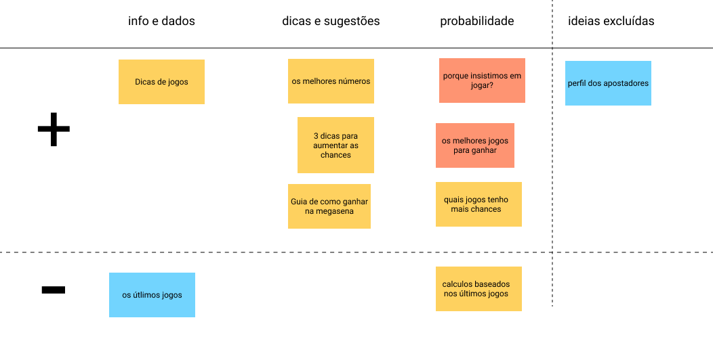
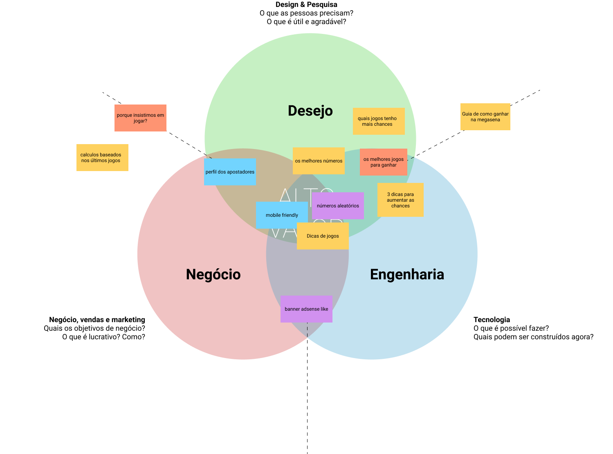
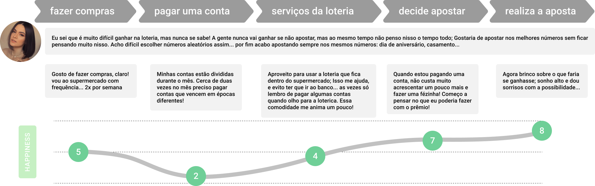
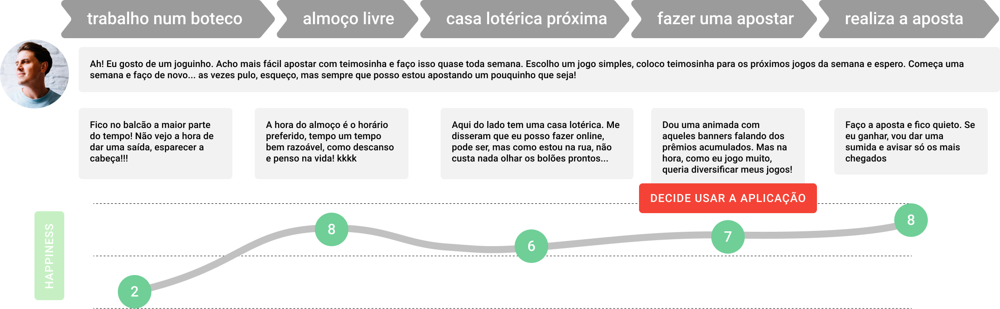

# Jogos da Loteria

Aplicação web para gerador de números aleatórios em jogos da loteria: mega-sena, lotofácil, quina, lotomania, timemania, dupla sena, dia de sorte.

---

## Sobre

A ideia de mudar de vida faz parte dos sonhos de muita gente, e não há nada de errado com isso! Muitos (literalmente) apostam em jogos da loteria para que esse sonho se realize.

### Mas o que nos motiva a jogar?

São dois fatores: O inconsciente, que atua nas *recompensas incertas* que ativam os neurônios responsáveis pela *satisfação*. E o consciente, que está associado ao *gosto pelo jogo* e de *apostar* basicamente por causa da dopamina liberada, parte do sistema de “recompensas” mencionado.

> Apostar na loteria entra nesse circuito, por conta da sensação positiva de se fazer algo de bom para o “eu futuro”

---

## Requisitos

*card sorting para identificar requisitos, pesquisas web, palavras relacionadas e ideias sobre loteria e jogos da loteria*

Os requisitos extraídos das pesquisas de mercado e mídia incluem:

- sugestões para jogos;
- os melhores números;
- dicas para aumentar as chances nos principais jogos da loteria.
- **mobile friendly**

## 360° view

## User journey

---

"Jornada do usuário" até o uso da aplicação; entender o usuário e suas necessidades numa breve jornada mesmo antes do uso da aplicação. Uma situação emergente e a necessidade apontadas pelos **requisitos**.

